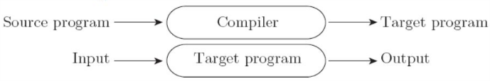
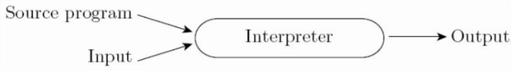
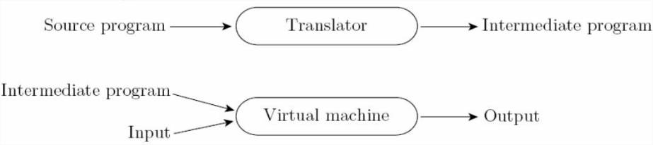
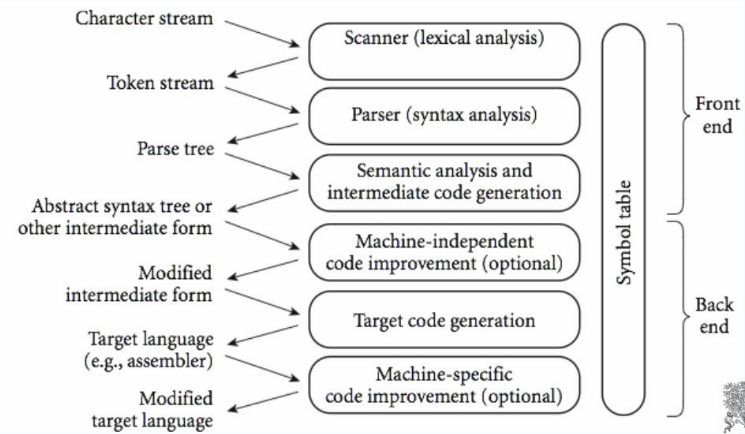
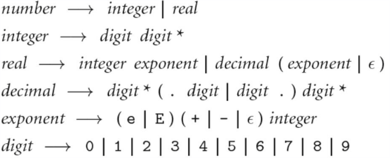
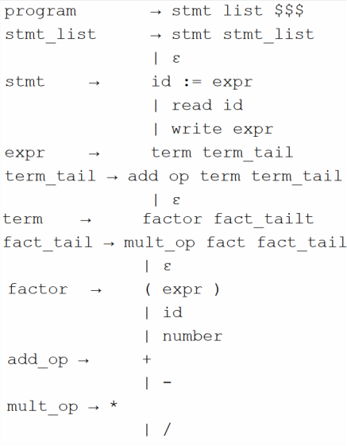
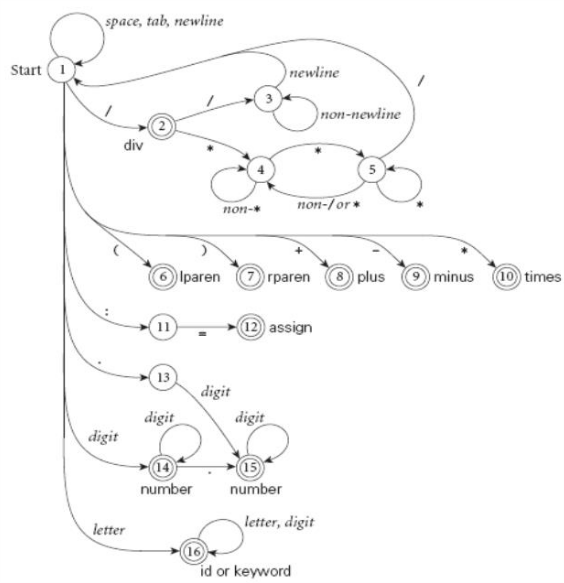

A quick review for CSCI-344 (Programming Language Concepts)


# Ch #1 What are Programming Languages

## Types

### Imperative

Most common type of language

- Von Neumann (Fortran, Basic, C)
- Object-oriented (SmallTalk, java)
- Scripting (perl, python, basic)

### Declarative

- Functional (Scheme, ML)
- Logical (Prolog)

## Compilation vs Interpretation

Interpretation is more flexible and gives better diagnostics for debugging.
Compilation provides better performance.
Often there is no clear cut difference between compilation and interpretation because many languages like java and python do a mix of the both.

### Compilation



### Interpretation




### Mixed




### Compilation Overview




# Ch #2 Parsing

## Context-Free Grammars

We use CFGs to produce a parse tree from tokens.



## LL Grammar

LL(1) grammar means that it is left right left most derivation parsing with one token look ahead.
In practice we would use a stack to keep track what we expect to see.
In this approach we would build the tree top down.
The LL parsing algorithm uses FIRST/FOLLOW/PREDICT tables.

Ex grammar:



## LR Grammar

LR (Left to right right most derivation) builds the tree bottom up and is almost always table driven.


## Scanning

A scanner is responsible for tokenizing the source, removing comments, saving text of identifiers, and saving line locations for error messages.
A scanner is most naturally represented as a DFA (Deterministic Finite Automaton).



# Ch #10 Object Oriented

Three major OO Components:

- Encapsulation
- Inheritance
- Dynamic method binding

Strict terms for OO lang: everything is an object, inheritance, dynamic method binding.
Since java has primitives, it is not a true OO language. 


## Small Talk

Started as a thesis project in the 1960's, has been noted as being one of the best OO language historically. 

Basic coding examples on class-inheritance and constructors may be on exam.

### Syntax

Excessively uses parenthesis.
Method calls are in the form: (function:: object parameter1 parameter 2).
NOTICE: the colons in the function name represents how many parameters it has.
Also, there are no commas between parameters.


Basic example class. 

```
(class Shape Object
    (perimeter area) ; class-level parameters
    
    ;constructor
    (class-method initalize::shape (per ar)
        (init::shape (new self) per ar)
    )

    (method init::shape (per ar)
        (setPerimeter: self per)
        (setArea: self ar)
        self
    )

    (method getPerimeter () 
        perimeter
    )
    
    (method getArea () 
        area
    )

    (method setArea: (a)
        (set area a)
    )

    (method setPerimeter: (p)
        (set perimeter p)
    )
)

(val shape1 (initalize::shape Shape 12 5))

; area
(getArea shape1)
(setArea: shape1 88)
(getArea shape1)
```


Example with inheritance:

```
(class Circle Shape
    (radius)

    (class-method initalize:circle (rad)
        (init:circle (new self) rad)
    )

    (method init:circle (rad)
        (setRadius: self rad)
        self
    )

    (method setRadius: (rad)
        (set radius rad)
        (setArea: self (computeArea self))
        (setPerimeter: self (computePerimeter self))
    )

    (method getRadius ()
        radius
    )

    (method computeArea ()
        (* 
            (asFloat (/ 22 7)) 
            (asFloat (squared radius))
        )
    )

    (method computePerimeter ()
        (* 
            (asFloat 2) 
            (* 
                (asFloat (/ 22 7)) 
                (asFloat radius)
            )
        )
    )
)


(val circle1 (initalize:circle Circle 5))
(getRadius circle1)
(getArea circle1)
(getPerimeter circle1)

(setRadius: circle1 6)
(getRadius circle1)
(getArea circle1)
(getPerimeter circle1)
```

# Ch #3


# Ch #4


# Ch #11


# Ch #6


# Ch #7


# Ch #12


# Ch #8


# Ch #13


# Ch #14